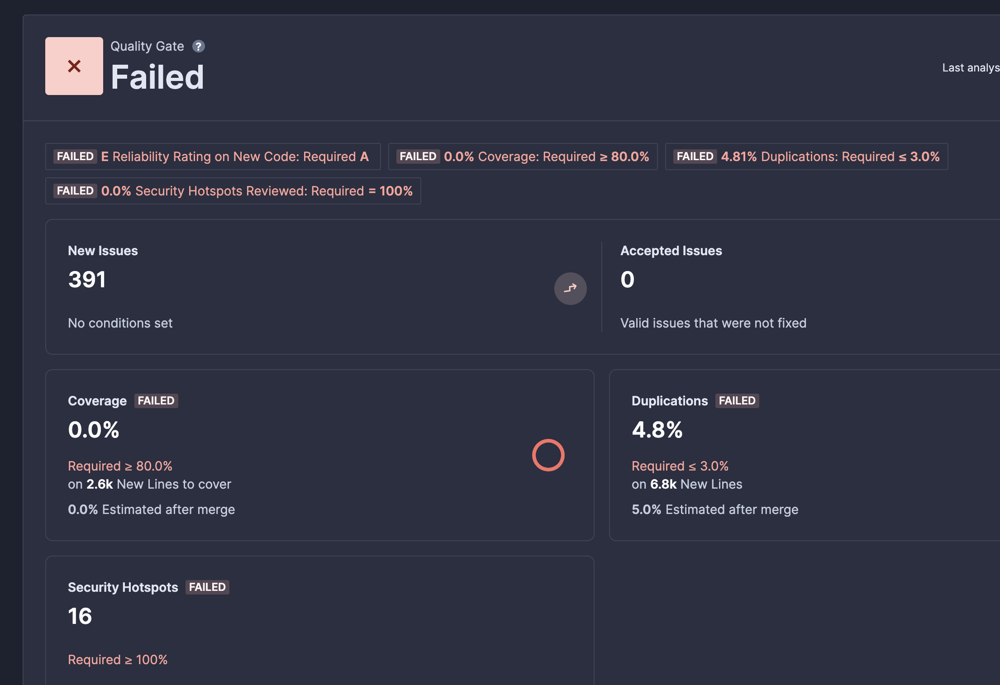
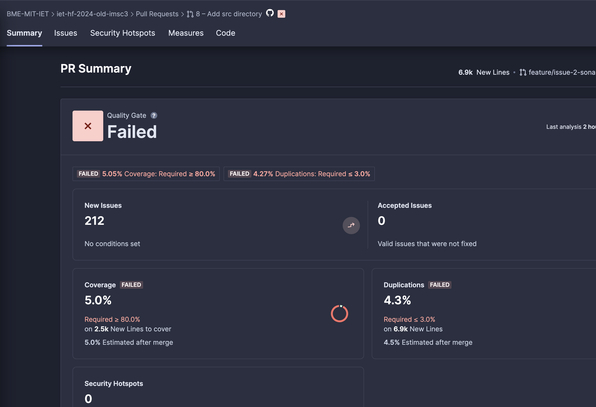

## Feladat
Manuális kód átvizsgálás elvégzése az alkalmazás egy részére (GitHub) + Statikus analízis eszköz futtatása és jelzett hibák átnézése (SonarCloud).
Mivel az eszközök rengeteg hibát és figyelmeztetést találhatnak, ezért elég azok egy részét megvizsgálni és ha a csapat minden tagja egyetért vele, akkor javítani. Törekedjetek arra, hogy különböző típusú, és lehetőleg nem triviális hibajelzéseket vizsgáljatok meg.
## Megoldás
A manuális küdátvizsgálásnál is már kijött, hogy sok code smellt tartalmaz a kódbázis, ezt a Sonarcloud bekötése meg is erősítette. A fő cél az volt, hogy a security hotspotokat megszűntessük és néhány tesztesetet felvegyünk. A tesztelést Mockito és Junit segítségével írtuk és jacocoval ellenőriztük lokálisan a kódlefedettséget.
 - kezdetben: 0 % test coverage, 391 issue, 4.8 % duplication, 16 security issue
 - végeredmény: 5 % test coverage, 212 issue és **_0 security hotspot_** (!!!)
 
 
## Kihívások, Eredmények, Tanulságok
Már a fejlesztési fázisban érdemes elkezdeni a kód minőségének javításást, ellenőrzését ilyen és hasonló framework-ök használatával, hogy később ne tornyosuljanak fel az issuek.
Előszőr azt akartuk, hogy át is menjen a sonar ellenőrzésen, de ez ilyen keretek között irreális lett volna, illetve nem tanított volna újabb tesztelési metódusokat, csak az eddig már felhasznált és bemutatott metodikákat használta volna újra.
