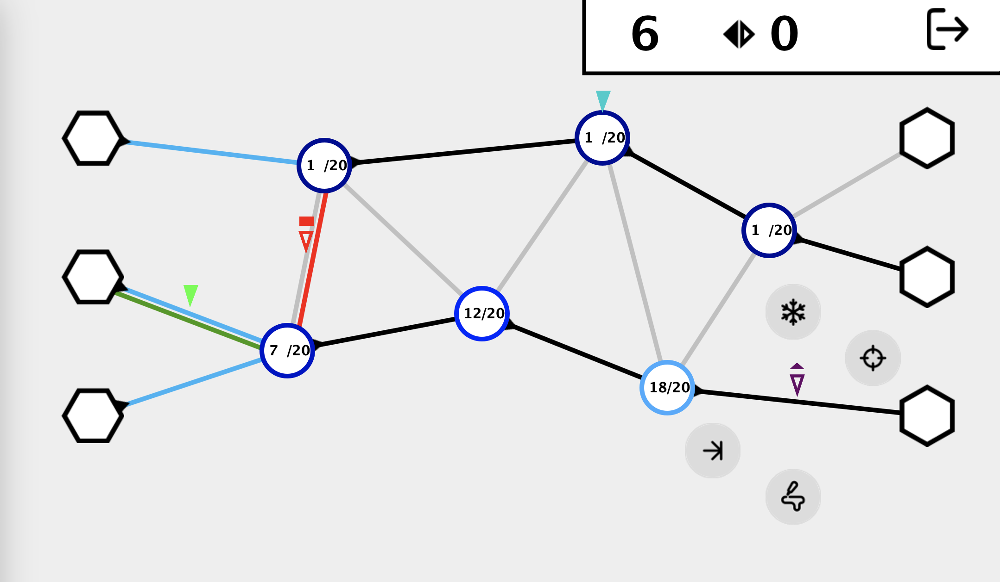
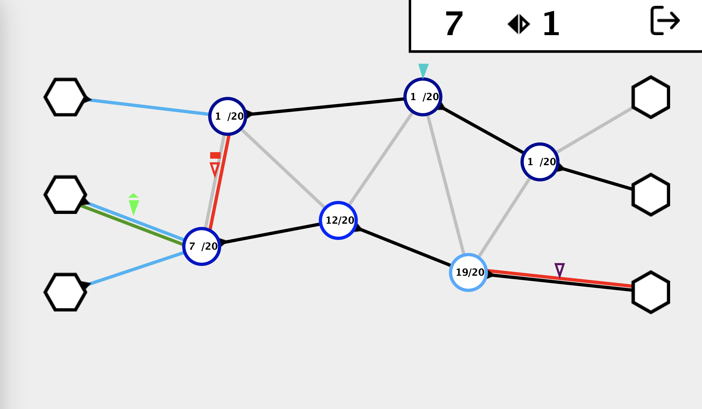
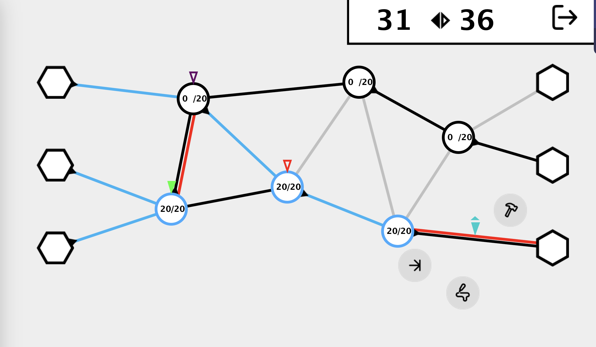
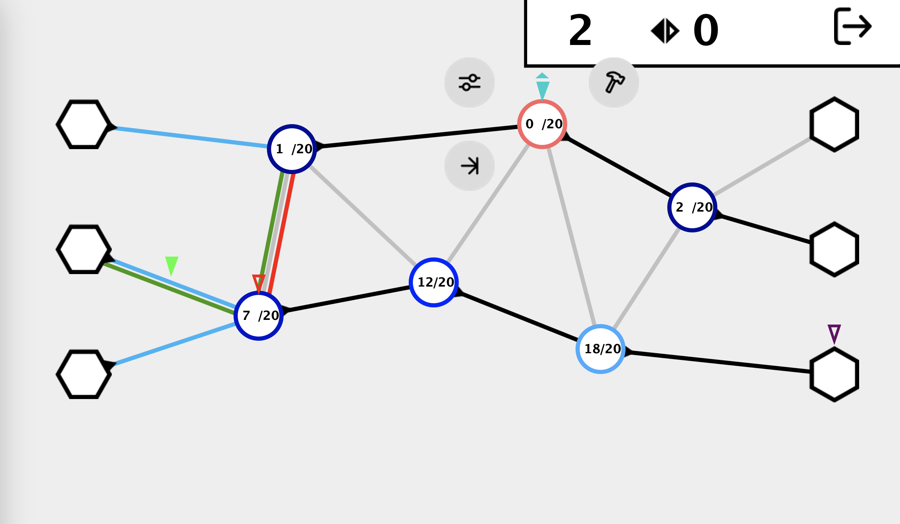
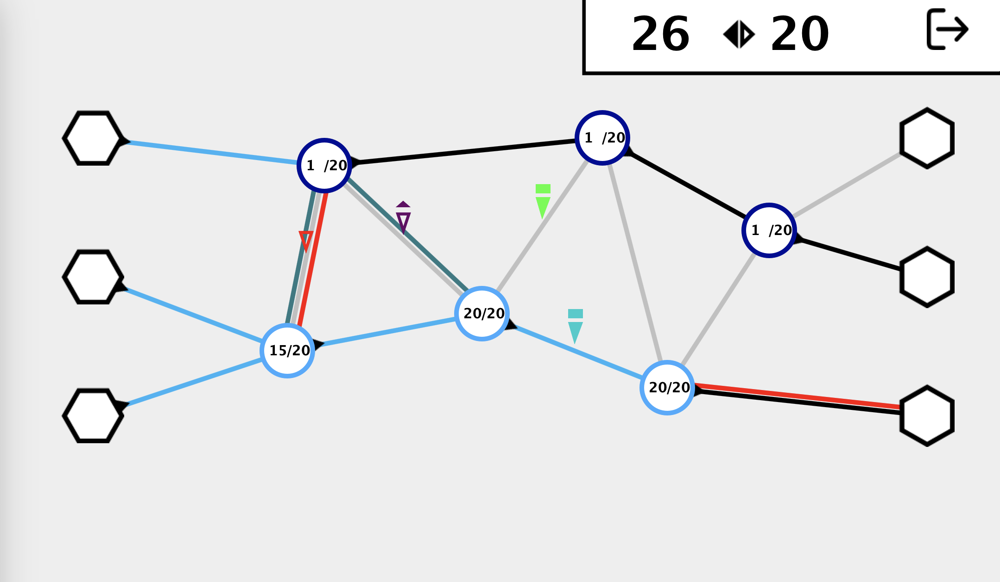
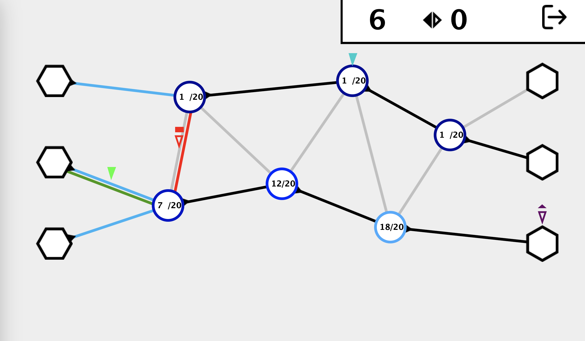
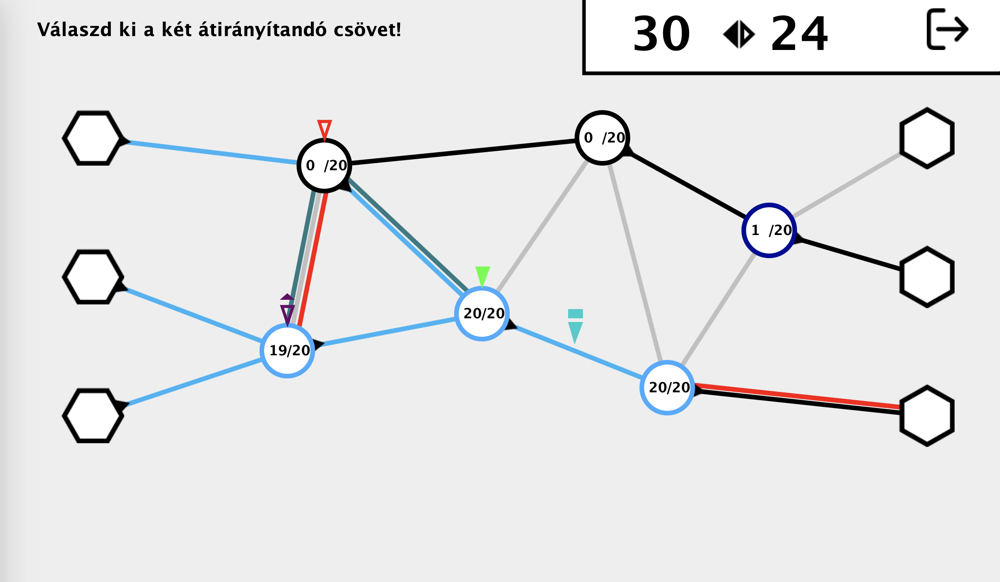
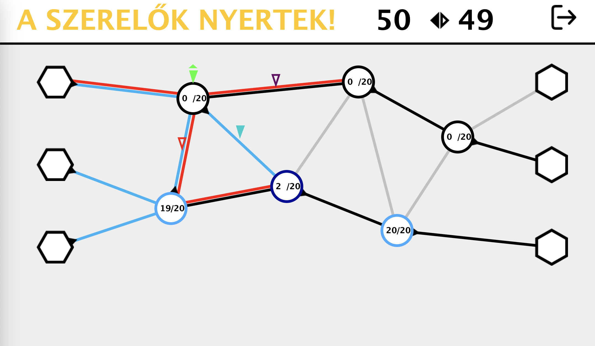
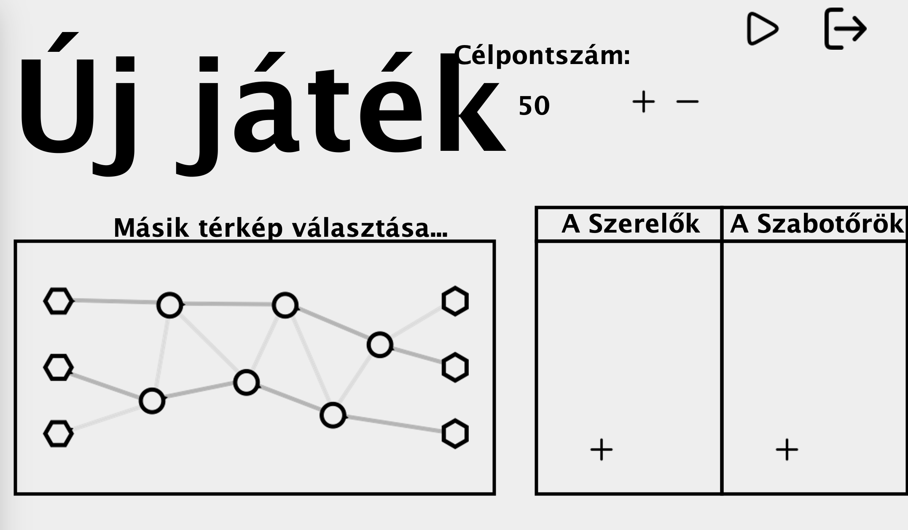

# Manuális tesztelés

## Célok

### 1. Funkcionalitás Tesztelése
**Cél**: Biztosítani, hogy a játék összes funkciója megfelelően működik a tervezett módon.
- **Példa**: Ellenőrizni, hogy minden gomb a főmenüben megfelelően működik, a játék különböző szintjei betöltődnek, az elemek mozgása és a játékmechanikák megfelelőek.

### 2. Felhasználói Élmény (UX)
**Cél**: Biztosítani, hogy a játék könnyen használható és élvezetes legyen a játékosok számára.
- **Példa**: Ellenőrizni a felhasználói felület elrendezését, a menük átláthatóságát, a vezérlők használhatóságát, és azt, hogy a játék élménye kielégítő legyen.

### 3. Hibák és Bugok Azonosítása
**Cél**: Minden lehetséges hiba és bug azonosítása és dokumentálása, hogy azok kijavításra kerülhessenek.
- **Példa**: Különböző játékmenet-szcenáriók tesztelése, váratlan események és hibák keresése, valamint azok dokumentálása.

## Tesztelési Folyamat

### 1. Funkcionalitás Tesztelése

#### 1.1. Főmenü Tesztelése - Új Játék
1. Indítsd el a játékot.
2. Ellenőrizd, hogy a főmenü megjelenik.
3. Kattints a "Új játék" gombra.
4. Ellenőrizd, hogy az Új játék menü megjelenik.

#### 1.2. Főmenü Tesztelése - Kilépés
1. Indítsd el a játékot.
2. Ellenőrizd, hogy a főmenü megjelenik.
3. Kattints a "Kilépés" gombra.
4. Ellenőrizd, hogy a játék bezáródik.

#### 1.3. Játékbeállítások Tesztelése - Szerelő hozzáadása
1. Az Új játék menüben, kattints a "Szerelő hozzáadása" gombra.
2. Ellenőrizd, hogy a Szerelő hozzáadása menü megjelenik.
3. Add meg a szerelő nevét.
4. Válassz színt a szerelőnek.
5. Kattints a "Save Character" gombra.
6. Ellenőrizd, hogy a szerelő hozzáadódik a játékhoz, a megadott névvel és színnel.

#### 1.4. Játékbeállítások Tesztelése - Szabotőr hozzáadása
1. Az Új játék menüben, kattints a "Szabotőr hozzáadása" gombra.
2. Ellenőrizd, hogy a Szabotőr hozzáadása menü megjelenik.
3. Add meg a szabotőr nevét.
4. Válassz színt a szabotőrnek.
5. Kattints a "Save Character" gombra.
6. Ellenőrizd, hogy a szabotőr hozzáadódik a játékhoz, a megadott névvel és színnel.

#### 1.5. Játékbeállítások Tesztelése - Térkép választása
1. Az Új játék menüben, kattints a "Másik térkép választása" gombra.
2. Ellenőrizd, hogy a kiválasztott térkép megváltozik.

#### 1.6. Játékbeállítások Tesztelése - Célpontszám beállítása
1. Az Új játék menüben, állítsd át a "Célpontszám" értéket a '+' és '-' gombokkal.
2. Ellenőrizd, hogy a célpontszám megváltozik.
3. Ellenőrizd, hogy a célpontszám nem lehet nulla vagy negatív.

#### 1.7. Játékbeállítások Tesztelése - Játék indítása kevesebb játékossal
1. Az Új játék menüben, kattints a "Játék indítása" gombra.
2. Ellenőrizd, hogy a játék nem indul el, ha nincs elég (2-2) játékos hozzáadva.

#### 1.8. Játékbeállítások Tesztelése - Játék indítása
1. Az Új játék menüben, add hozzá a szükséges mennységű játékost. (2-2)
2. Kattints a "Játék indítása" gombra.
3. Ellenőrizd, hogy a játék elindul, a megfelelő játékosokkal és térképpel.

#### 1.9. Játékmenet Tesztelése - Mozgás
1. Jobbklikkelj egy, az aktuális játékossal szomszédos mezőre.
2. Kattints a mozgás ikonra.
3. Ellenőrizd, hogy a játékos a kiválasztott mezőre mozog.

#### 1.10. Játékmenet Tesztelése - Szabotőr akcióinak megjelenése
1. Szabotőr csőre mozgatása után, jobbklikkelj a csőre.
2. Ellenőrizd, hogy a szabotőr akciói megjelennek. (lyukasztás, fagyasztás, ragasztás, vége)

#### 1.11. Játékmenet Tesztelése - Szerelő akcióinak megjelenése
1. Szerelő csőre mozgatása után, jobbklikkelj a csőre.
2. Ellenőrizd, hogy a szerelő akciói megjelennek. (lyukasztás, ragasztás, vége)

#### 1.12. Játékmenet Tesztelése - Szabotőr lyukasztás akció
1. Szabotőr nem lyukas csőre mozgatása után, jobbklikkelj a csőre.
2. Ellenőrizd, hogy a szabotőr lyukasztás akciója megjelenik.
3. Kattints a lyukasztás ikonra.
4. Ellenőrizd, hogy a cső lyukasztva lett. (piros)

#### 1.13. Játékmenet Tesztelése - Szerelő javítás akció csövön
1. Szerelő lyukas csőre mozgatása után, jobbklikkelj a csőre.
2. Ellenőrizd, hogy a szerelő javítás akciója megjelenik.
3. Kattints a javítás ikonra.
4. Ellenőrizd, hogy a cső javítva lett. (nem piros)

#### 1.14. Játékmenet Tesztelése - Szerelő javítás akció pumpán
1. Szerelő elromlott (piros) pumpára mozgatása után, jobbklikkelj a pumpára.
2. Ellenőrizd, hogy a szerelő javítás akciója megjelenik.
3. Kattints a javítás ikonra.
4. Ellenőrizd, hogy a pumpa javítva lett. (nem piros)

#### 1.15. Játékmenet Tesztelése - Szabotőr fagyasztás akció
1. Szabotőr nem fagyott csőre mozgatása után, jobbklikkelj a csőre.
2. Kattints a fagyasztás ikonra.
3. Ellenőrizd, hogy a cső fagyott lett. (türkizkék)

#### 1.16. Játékmenet Tesztelése - Ragasztott cső
1. Mozogj egy ragasztott csőre.
2. Ellenőrizd, hogy a játékos nem tud mozogni egy kör erejéig.

#### 1.17. Játékmenet Tesztelése - Cső átirányítása
1. Pumpára mozgás után, jobbklikkelj a pumpára.
2. Ellenőrizd, hogy a cső átirányítás akciója megjelenik.
3. Kattints a cső átirányítás ikonra.
4. Ellenőrizd, hogy a "Válaszd ki a két átirányítandó csövet!" üzenet megjelenik.
5. Válaszd ki a két csövet.
6. Ellenőrizd, hogy az átirányítás sikeres volt.

#### 1.18. Játékmenet Tesztelése - Játék vége
1. Ellenőrizd, hogy a játék véget ér, ha valamelyik csapat eléri a célpontszámot.
2. Ellenőrizd, hogy a megfelelő üzenet jelenik meg a játék végén.

### 2. Felhasználói Élmény (UX)

#### 2.1. Menürendszer Tesztelése
1. Ellenőrizd, hogy a menük könnyen navigálhatóak és érthetőek.
2. Ellenőrizd, hogy a menük és gombok esztétikusak és jól láthatóak.

#### 2.2. Beállítások Tesztelése
1. Ellenőrizd, hogy a játékbeállítások könnyen navigálhatóak és érthetőek.
2. Ellenőrizd, hogy a játékbeállítások változtatása egyszerű és gyors.
3. Ellenőrizd, hogy a játékbeállítások esztétikusak és jól láthatóak.
4. Ellenőrizd, hogy a játékbeállítások alapértelmezett értékei megfelelőek.

#### 2.3. Játékmenet Tesztelése
1. Ellenőrizd, hogy a játékmenet könnyen érthető és élvezetes.
2. Ellenőrizd, hogy a játékmenet esztétikus és jól látható.
3. Ellenőrizd, hogy a játékmenet során a játékosoknak megfelelő visszajelzések jelennek meg.
4. Ellenőrizd, hogy a játékmenet során a játékosoknak megfelelő segítségnyújtás érhető el.

### 3. Hibák Azonosítása

#### 3.1. Játékmenet Hibáinak Tesztelése
1. Ellenőrizd, hogy a játékmenet során nem jelennek meg váratlan hibák.
2. Ellenőrizd, hogy a játékmenet során a játékosoknak megfelelő hibaüzenetek jelennek meg.

## Tesztelési Eredmények

### 1. Funkcionalitás Tesztelése

#### 1.1. Főmenü Tesztelése - Új Játék
**Teszt Eset Azonosító**: TC001
- **Leírás**: Főmenü megjelenése és új játék indítása.
- **Eredmény**: A főmenü megjelent, az "Új játék" gomb működött és az új játék menü megjelent.
- **Státusz**: Sikeres
- **Megjegyzés**: Nincs

#### 1.2. Főmenü Tesztelése - Kilépés
**Teszt Eset Azonosító**: TC002
- **Leírás**: Főmenü megjelenése és kilépés a játékból.
- **Eredmény**: A főmenü megjelent, a "Kilépés" gomb megfelelően működött.
- **Státusz**: Sikeres
- **Megjegyzés**: Nincs

#### 1.3. Játékbeállítások Tesztelése - Szerelő hozzáadása
**Teszt Eset Azonosító**: TC003
- **Leírás**: Szerelő hozzáadása az új játék menüben.
- **Eredmény**: A szerelő hozzáadása sikeres volt, de a neve helyett a színkódja jelenik meg, megfelelő színnel.
- **Státusz**: Sikertelen
- **Megjegyzés**: A szerelő nevének megjelenítése hibás, a színkód helyett a neve jelenjen meg.

#### 1.4. Játékbeállítások Tesztelése - Szabotőr hozzáadása
**Teszt Eset Azonosító**: TC004
- **Leírás**: Szabotőr hozzáadása az új játék menüben.
- **Eredmény**: A szabotőr hozzáadása sikeres volt, de a neve helyett a színkódja jelenik meg, megfelelő színnel.
- **Státusz**: Sikeretlen
- **Megjegyzés**: A szabotőr nevének megjelenítése hibás, a színkód helyett a neve jelenjen meg.

#### 1.5. Játékbeállítások Tesztelése - Térkép választása
**Teszt Eset Azonosító**: TC005
- **Leírás**: Térkép választása az új játék menüben.
- **Eredmény**: A kiválasztott térkép megváltozott.
- **Státusz**: Sikeres
- **Megjegyzés**: Nincs

#### 1.6. Játékbeállítások Tesztelése - Célpontszám beállítása
**Teszt Eset Azonosító**: TC006
- **Leírás**: Célpontszám beállítása az új játék menüben.
- **Eredmény**: A célpontszám beállítása sikeres volt, a célpontszám nem lehet nulla vagy negatív.
- **Státusz**: Sikeres
- **Megjegyzés**: Nincs

#### 1.7. Játékbeállítások Tesztelése - Játék indítása kevesebb játékossal
**Teszt Eset Azonosító**: TC007
- **Leírás**: Játék indítása kevesebb játékossal az új játék menüben.
- **Eredmény**: A játék nem indult el, ha nincs elég (2-2) játékos hozzáadva.
- **Státusz**: Sikeres
- **Megjegyzés**: Nincs

#### 1.8. Játékbeállítások Tesztelése - Játék indítása
**Teszt Eset Azonosító**: TC008
- **Leírás**: Játék indítása a megfelelő számú játékossal.
- **Eredmény**: A játék elindult, a megfelelő játékosokkal és térképpel.
- **Státusz**: Sikeres
- **Megjegyzés**: Nincs

#### 1.9. Játékmenet Tesztelése - Mozgás
**Teszt Eset Azonosító**: TC009
- **Leírás**: Játékos mozgása egy szomszédos mezőre.
- **Eredmény**: A játékos a kiválasztott mezőre mozgott.
- **Státusz**: Sikeres
- **Megjegyzés**: Nincs

#### 1.10. Játékmenet Tesztelése - Szabotőr akcióinak megjelenése
**Teszt Eset Azonosító**: TC010
- **Leírás**: Szabotőr akcióinak megjelenése egy csőre mozgatás után.
- **Eredmény**: A szabotőr akciói megjelentek (lyukasztás, fagyasztás, ragasztás, vége).
- **Státusz**: Sikeres
- **Megjegyzés**: Nincs

#### 1.11. Játékmenet Tesztelése - Szerelő akcióinak megjelenése
**Teszt Eset Azonosító**: TC011
- **Leírás**: Szerelő akcióinak megjelenése egy csőre mozgatás után.
- **Eredmény**: A szerelő akciói megjelentek (lyukasztás, ragasztás, vége).
- **Státusz**: Sikeres
- **Megjegyzés**: Nincs

#### 1.12. Játékmenet Tesztelése - Szabotőr lyukasztás akció
**Teszt Eset Azonosító**: TC012
- **Leírás**: Szabotőr lyukasztás akciójának tesztelése.
- **Eredmény**: Az akció megjelent, és a cső lyukasztva lett (piros).
- **Státusz**: Sikeres
- **Megjegyzés**: Nincs

#### 1.13. Játékmenet Tesztelése - Szerelő javítás akció csövön
**Teszt Eset Azonosító**: TC013
- **Leírás**: Szerelő javítás akciójának tesztelése egy lyukas csövön.
- **Eredmény**: Az akció megjelent, és a cső javítva lett (nem piros).
- **Státusz**: Sikeres
- **Megjegyzés**: Nincs

#### 1.14. Játékmenet Tesztelése - Szerelő javítás akció pumpán
**Teszt Eset Azonosító**: TC014
- **Leírás**: Szerelő javítás akciójának tesztelése egy elromlott (piros) pumpán.
- **Eredmény**: A pumpa javítva lett (nem piros).
- **Státusz**: Sikeres
- **Megjegyzés**: Nincs

#### 1.15. Játékmenet Tesztelése - Szabotőr fagyasztás akció
**Teszt Eset Azonosító**: TC015
- **Leírás**: Szabotőr fagyasztás akciójának tesztelése.
- **Eredmény**: A cső fagyott lett (türkizkék).
- **Státusz**: Sikeres
- **Megjegyzés**: Nincs

#### 1.16. Játékmenet Tesztelése - Ragasztott cső
**Teszt Eset Azonosító**: TC016
- **Leírás**: Játékos mozgása egy ragasztott csőre.
- **Eredmény**: A játékos nem tudott mozogni egy kör erejéig.
- **Státusz**: Sikeres
- **Megjegyzés**: Nincs

#### 1.17. Játékmenet Tesztelése - Cső átirányítása
**Teszt Eset Azonosító**: TC017
- **Leírás**: Cső átirányítása egy pumpa használatával.
- **Eredmény**: A megfelelő üzenet megjelent, és az átirányítás sikeres volt.
- **Státusz**: Sikeres
- **Megjegyzés**: Nincs

#### 1.18. Játékmenet Tesztelése - Játék vége
**Teszt Eset Azonosító**: TC018
- **Leírás**: A játék vége, ha valamelyik csapat eléri a célpontszámot.
- **Eredmény**: A játék véget ért, és a megfelelő üzenet megjelent.
- **Státusz**: Sikeres
- **Megjegyzés**: Nincs

### 2. Felhasználói Élmény (UX)

#### 2.1. Menürendszer Tesztelése
**Teszt Eset Azonosító**: TC019
- **Leírás**: A menürendszer navigálhatóságának és esztétikájának ellenőrzése.
- **Eredmény**: A menük könnyen navigálhatóak és jól láthatóak voltak,
                de az "Új játék" és "Célpontszám" feliratok enyhén átfednek.
- **Státusz**: Sikertelen
- **Megjegyzés**: Az átfedés javítása szükséges.

#### 2.2. Játék közbeni visszajelzések tesztelése
**Teszt Eset Azonosító**: TC020
- **Leírás**: Játék közbeni vizuális visszajelzések ellenőrzése.
- **Eredmény**: A visszajelzések megfelelően működtek.
- **Státusz**: Sikeres
- **Megjegyzés**: Nincs

### 3. Hibák Azonosítása

#### 3.1. Játékmenet Hibáinak Tesztelése
**Teszt Eset Azonosító**: TC021
- **Leírás**: Váratlan hibák és hibaüzenetek tesztelése.
- **Eredmény**: Nem jelentek meg váratlan hibák, 
                viszont a hibaüzenetek hiányoznak a játékmenet során.
- **Státusz**: Sikertelen
- **Megjegyzés**: A hibaüzenetek megjelenítése szükséges.

## Kihívások, Eredmények, Tanulságok

### Kihívások
1. **Komplexitás kezelése**: A játék funkcióinak részletes és átfogó tesztelése nagy odafigyelést igényelt.
2. **Bugok és hibák dokumentálása**: A tesztelési folyamat során számos apró, de kritikus hibát kellett azonosítani és pontosan dokumentálni, ez időigényes volt.

### Eredmények
1. **Funkcionalitás**: A játék legtöbb funkciója megfelelően működött, beleértve a játék indítását, különböző akciók végrehajtását és a játék vége eseményeket.
2. **Felhasználói élmény**: A menük és a játékmenet navigációja nagyrészt kielégítő volt, bár néhány kisebb UX hiba javítása szükséges.
3. **Hibák azonosítása**: Számos hibát sikerült azonosítani és dokumentálni, mint például a karakterek neve helyett színkódok megjelenítése, illetve a hibaüzenetek hiánya.

### Tanulságok
1. **Tesztelési terv fontossága**: A részletes és jól kidolgozott tesztelési terv segített abban, hogy minden funkciót alaposan ellenőrizzünk, és azonosítsuk a hibákat.
2. **Átfogó tesztelés**: A játék minden részletét és funkcióját érdemes alaposan tesztelni, hogy biztosak lehessünk a játék minőségében. Ez manuális teszteléssel időigényes, de szükséges és hatékony folyamat.

